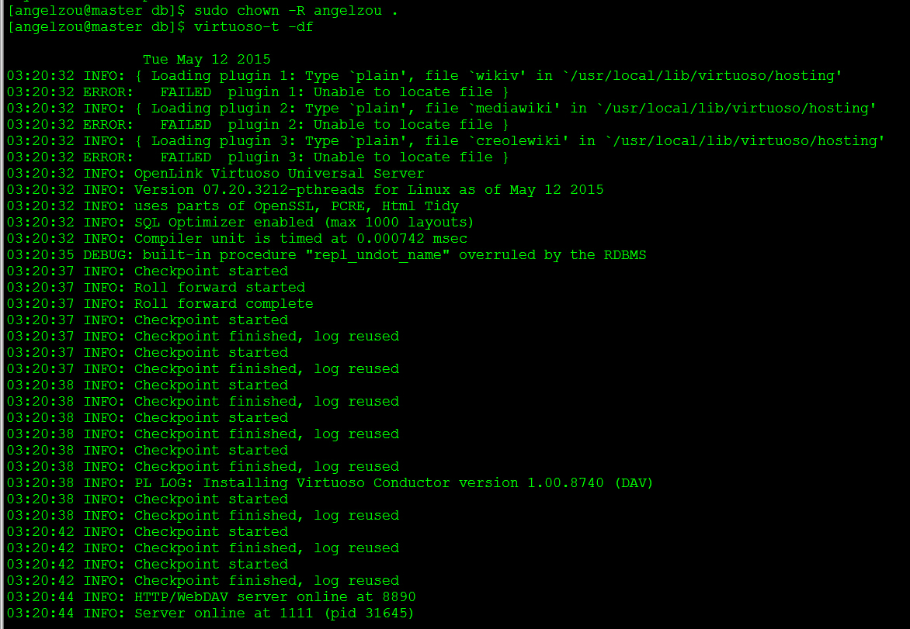

##Virtuoso opensource install on centos
> CentOS 6.5  
> Virtuoso Open Source 7.2

#####开始的准备
1. 开放8890端口   

		[root@master ~]$ /sbin/iptables -I INPUT -p tcp --dport 8890 -j ACCEPT 
		[root@master ~]$ /etc/rc.d/init.d/iptables save
		[root@master ~]$ /etc/init.d/iptables status

2. 建议新建一个普通用户来编译代码  

		[root@master ~]$ useradd angelzou
		[root@master ~]$ passwd angelzou   (然后会提示输入密码)

3. 给普通用户添加sudo权限，运行 ```visudo``` 命令，将用户添加到sudoers。找到 ```root ALL(ALL) ALL``` 这一行，在其后面添加新增的用户，比如 ```angelzou ALL(ALL) ALL``` 
		
		[root@master ~]$ visudo

###安装Virtuoso
1. 安装依赖包

		[angelzou@master ~]$ sudo yum install gcc gmake autoconf automake libtool flex \
	      bison gperf gawk m4 make openssl-devel readline-devel wget


2. 开源包下载   

	2.1 下载地址   
	+ [openlink/virtuoso-opensource-github](https://github.com/openlink/virtuoso-opensource)  
	+ [virtuoso--sourceforge.net](http://sourceforge.net/projects/virtuoso/files/virtuoso/)    
	
	2.2 例：从sourceforge中下载下来，并解压缩
 
		[angelzou@master ~]$ wget http://hivelocity.dl.sourceforge.net/project/virtuoso/virtuoso/7.2.0/virtuoso-opensource-7.2.0_p1.tar.gz   
		[angelzou@master ~]$ tar xvpfz virtuoso-opensource-7.2.0_p1.tar.gz  
		[angelzou@master ~]$ mv virtuoso-opensource-7.2.0_p1 virtuoso-opensource-7.2.0     

3. 配置   

	3.1  在本示例中，使用简单的配置   

		[angelzou@master ~]$ cd virtuoso-opensource-7.2.0
		[angelzou@master virtuoso-opensource-7.2.0]$ ./configure --prefix=/usr/local/ --with-readline 
  
	
	3.2  在这一配置阶段，还可以指定其他配置的选项，可以启用/禁用构建插件包（Perl、Python、Ruby），或者各种VAD安装包（Virtuoso的子包）。想要了解更多，可以阅读相关的README文件和运行 ```./configure --help``` 命令。    

4. VOS组件位置   

	4.1  Virtuoso实例通常处在文件系统的指定目录中，以配置文件（virtuoso.ini）为中心，配置文件会指定操作参数，比如：数据库页文件的文件名的使用，端口号的使用，线程数和缓冲区的使用等  

	4.2  对于上面的命令，我们指定 ```/usr/local``` 为Virtuoso的 ```./configure``` 脚本的前缀。Virtuoso将会被创建/使用，形式一个基本的结构目录，如下所示：
	+ /usr/local/lib/   
		+ Sesame, JDBC, Jena, Hibernate等各种包文件
	+ /usr/local/bin/   
		+ 主要的执行文件，如：virtuoso-t、isql
	+ /usr/local/share/virtuoso/vad/   
		+ 存储VAD归档文件
	+ /usr/local/share/virtuoso/doc/    
		+ 本地脱机文档
	+ /usr/local/var/lib/virtuoso/db/  
		+ 一个Virtuoso实例默认的位置
	+ /usr/local/var/lib/virtuoso/vsp/   
		+ 各种VSP脚本 —— 在Conductor安装之前的默认主页

	4.3 其他目录结构可能被各种指定    
	+ 个人配置项，例如： ```--bindir```，```--libdir```等等
	+ ```--width-layout=GNU|Debian|Gentoo|RedHat|FreeBSD|opt|OpenLink}```   

5. Building和安装
	+ 选择一些配置选项，运行make：
			
			[angelzou@master virtuoso-opensource-7.2.0]$ nice make
	+ 可选的。你可以运行```make check```来运行测试套件。（它需要很长时间并且耗费很多字节和磁盘空间）  
			
			[angelzou@master virtuoso-opensource-7.2.0]$ nice make check
	+ 安装
			
			[angelzou@master virtuoso-opensource-7.2.0]$ sudo make install


####开始运行
1. 进行virtuoso.ini文件所在的目录，给普通用户授权，打开服务
		
		[angelzou@master virtuoso-opensource-7.2.0]$ cd /usr/local/var/lib/virtuoso/db/
		[angelzou@master db]$ sudo chown -R angelzou .
		[angelzou@master db]$ virtuoso-t -df

  
	+ 如上图所示，virtuoso实例在前台运行。因为是第一次运行，它会创建一些数据库文件（如virtuoso.db,virtuoso.trx等等），而且也会将Conducotor VAD安装到数据库中
	+ 如果你关闭终端，Virtuoso会停止。如果需要以daemon程序来运行，需要去掉 ```-df``` ，即直接运行 ```virtuoso-t``` 命令即可      
	

这样即可访问WEB UI了 (http://localhost:8890/coductor)
    
    
    

####英文文档   
[How to Install Virtuoso Open Source (VOS) on CentOS Linux](http://virtuoso.openlinksw.com/dataspace/doc/dav/wiki/Main/VOSCentosNotes)